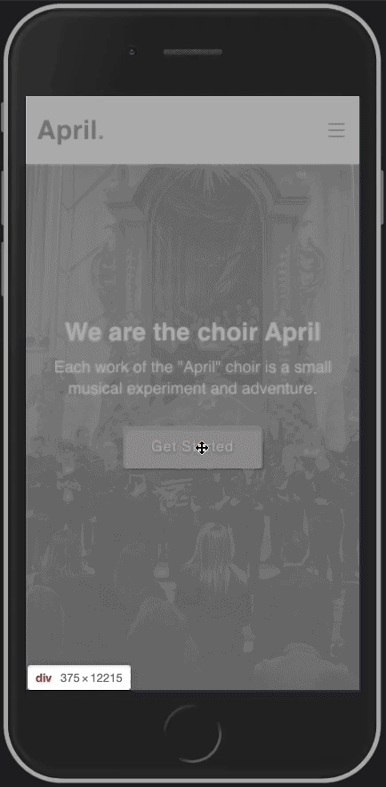

# Website for Choir April
The website showcases the Choir April group and their upcoming performances. The website is fully responsive and includes features such as filterable image gallery and a contact form.

Deployed to GitHub Pages: https://elizpn.github.io/april/

## Technologies and libraries used: 

-  Language - [TypeScript](https://www.typescriptlang.org/)
-  Client Framework - [React](https://reactjs.org)
-  Styles - [Bootstrap](https://getbootstrap.com/) 

# Desctop version demo: 

# Mobile version demo: 

